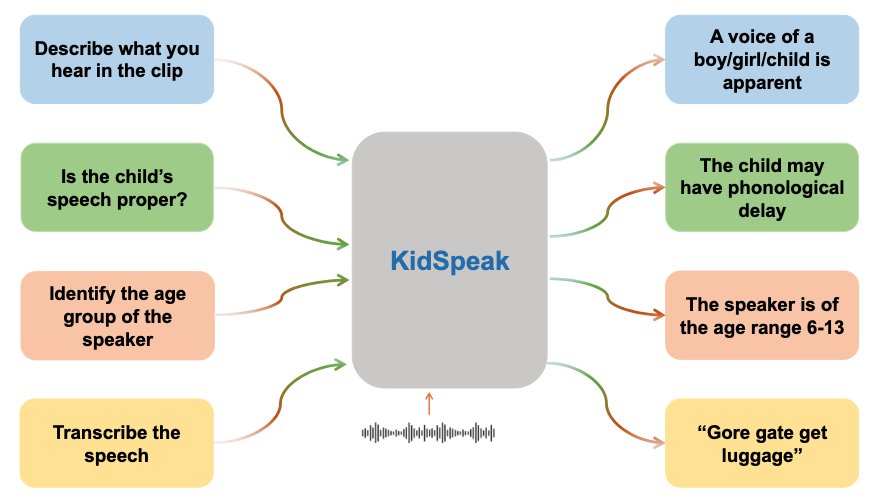

# KidSpeak: A General Multi-purpose LLM for Kids' Speech Recognition and Screening

[](https://arxiv.org/abs/2512.05994)
[](https://huggingface.co/datasets/jsun39/KidSpeak-Instruct)
[](https://huggingface.co/jsun39/kidspeak_vicuna)

<p align="center"></p>

KidSpeak is a speech LLM for children's speech. Given an audio clip and a question, it answers in
natural language. One model handles several tasks:

| Task | Example question | Metric |
|---|---|---|
| Speech description / gender | *Describe what you hear in the clip.* | accuracy |
| Speech-disorder screening (binary) | *Is the child's speech typical or impaired?* | accuracy |
| Disorder type (6 SSD subtypes) | *What category of disorder does it fall into?* | accuracy |
| Age prediction | *Can you tell the age of the speaker?* | exact / age-group accuracy |
| Transcription | *Transcribe the speech.* | WER / CER |
| Dialect (native / non-native UK) | *Identify the speaker's dialect by their accent nuances.* | accuracy |

## Method

```
audio ─► Whisper encoder (frozen) ─► [B,1500,D] ─► stack 6 frames ─► [B,250,6D] ─► Linear ─► [B,250,4096]
                                                                                            │
 "<s>### Human: " + [250 audio tokens] + "</Img> {question}\n### Assistant:" ─► Vicuna-7B + LoRA ─► answer
```

* **Audio encoder:** OpenAI Whisper encoder (`tiny` … `large-v3`), kept frozen.
* **Projection:** six consecutive Whisper frames are concatenated into one token, which gives 250 tokens
  per 30 s clip. A single linear layer then maps each token to the LLM hidden size.
* **LLM:** Vicuna-7B v0 ([`jsun39/kidspeak_vicuna`](https://huggingface.co/jsun39/kidspeak_vicuna)) with
  LoRA (r=16, α=32) on `q/k/v/o_proj`.
* **Training:** multi-turn instruction tuning with cross-entropy on the assistant turns only. Only the
  LoRA adapters and the projection are trained (~70 MB per checkpoint with Whisper-small).

## Repository structure

```
KidSpeak/
├── train.py              # DeepSpeed instruction tuning
├── inference.py          # multi-turn QA on a test split  -> predictions.jsonl
├── compute_metrics.py    # predictions.jsonl -> per-task metrics
├── kidspeak/
│   ├── model.py          # KidSpeak model (Whisper + projection + LoRA Vicuna)
│   ├── audio.py          # audio loading / log-Mel features
│   ├── dataset.py        # instruction dataset
│   └── modeling_llama.py # LLaMA implementation (from HF transformers)
├── configs/
│   ├── kidspeak.yaml     # model / LoRA / epochs
│   └── ds_config.json    # DeepSpeed: batch size, lr, optimizer, bf16
├── data_prep/
│   ├── build_dataset.py  # raw corpora -> instruction JSON (optional)
│   └── prompts/          # question / answer templates
├── scripts/
│   ├── train.sh
│   └── eval.sh
│   # created at run time (not tracked by git):
├── envs/                 # conda environment
├── dataset/              # json/ + KIDS/ audio
├── checkpoint/           # trained checkpoints
└── outputs/              # predictions and metrics
```

## 1. Installation

Tested with Python 3.10, CUDA 11.8, PyTorch 2.4 and 4× A6000 / A100 GPUs.

```bash
conda create -y -p envs/kidspeak python=3.10     # the environment lives inside the repo
conda activate ./envs/kidspeak
pip install torch==2.4.0 torchaudio==2.4.0 --index-url https://download.pytorch.org/whl/cu118
pip install -r requirements.txt
```

## 2. Data

KidSpeak is trained on three corpora of child speech. Each corpus is split **7:3 into train / test at the
speaker level**, stratified by label, so every child is in exactly one split.

| Corpus | Children | Clips | Tasks | Split |
|---|---:|---:|---|---|
| **UltraSuite** – UPX (20, SSD with subtype) + UXSSD (8, SSD) + UXTD (58, typically developing) | 86 | 4,832 | disorder (binary), SSD subtype (UPX only), age, gender, transcription (1,671 clips) | stratified by SSD subtype (UPX), SSD (UXSSD), typical (UXTD) |
| **ENNI** (TalkBank CHILDES, TD vs. SLI) | 351 | 14,654 | description, transcription, age, gender, disorder (binary) | stratified by TD / SLI |
| **English children** (Kennedy et al., HRI 2017) | 11 | 272 | description, transcription, dialect, gender | stratified by native / non-native |

| split | UltraSuite | ENNI | English children | merged |
|---|---:|---:|---:|---:|
| train | 3,414 (60 children) | 10,349 (246) | 181 (7) | 13,944 |
| test | 1,418 (26) | 4,305 (105) | 91 (4) | 5,814 |

The speaker IDs of every split are listed in `dataset/json/split_stats.json`.

**UltraSuite clips.** Only baseline sessions (UPX / UXSSD) and prompts of type *words*, *sentence* and
*non-words* are used. These types are shared by all three subsets, so typical and disordered children say the
same kind of material. Articulatory teaching and non-speech prompts (e.g. swallowing) are dropped. Many clips
also contain the therapist's voice, so every clip is cropped to the child's speech. The child segments come from
the [UltraSuite labels release](https://ultrasuite.github.io/): manually revised word / speaker labels where
available, otherwise the automatic speaker labels. Transcriptions come from the manual UXTD transcriptions
(therapist speech and utterances with unintelligible or partial words removed) and the manually revised UXSSD /
UPX word labels.

**Balancing the binary disorder question.** In ENNI, TD children produce ~83% of the clips; in UltraSuite,
SSD children produce ~2/3. All clips are kept for the other tasks, but within each split the disorder question
is only asked for the minority class and for a random subset of majority-class children with about the same
number of clips:

| | UltraSuite (SSD / typical) | ENNI (SLI / TD) |
|---|---:|---:|
| train | 1,283 / 1,128 | 1,756 / 1,758 |
| test | 476 / 439 | 769 / 773 |

### 2.1 Audio

Put the audio under `dataset/KIDS/`. The JSON files refer to audio by paths relative to `dataset/`.

```
dataset/KIDS/
├── ultrasuite_disorder/
│   ├── core-upx/{core,doc}/      # baseline (BL*) sessions are used
│   ├── core-uxssd/{core,doc}/    # baseline (BL*) sessions are used
│   ├── core-uxtd/{core,doc}/
│   ├── labels/{upx,uxssd,uxtd}/  # UltraSuite labels release
│   └── child_only/               # written by build_dataset.py
├── talkbank_dataset/v1.3/official_v1.3/
│   ├── talkbank_childes.csv
│   └── usable/FASA_ENNI/out/<child_id>/*.mp3 (+ .txt)
└── english_children/
    ├── english_free_speech/files_cut_by_sentences/
    └── english_words_sentences/
```

* **UltraSuite** ([website](https://ultrasuite.github.io/download/), CC BY-NC 4.0). Each subset is ~100 GB,
  but most of that is ultrasound. The audio, prompts, metadata and labels alone take ~4 GB:
  ```bash
  mkdir -p dataset/KIDS/ultrasuite_disorder && cd dataset/KIDS/ultrasuite_disorder
  for m in core-upx core-uxssd core-uxtd; do
    rsync -a --include='*/' --include='*.wav' --include='*.txt' --include='doc/**' --exclude='*' \
      ultrasuite-rsync.inf.ed.ac.uk::ultrasuite/$m/ $m/
  done
  rsync -a --include='*/' --include='doc/**' --include='speaker_labels/lab/**' --include='transcriptions/**' \
    --include='reference_labels/speaker-labels/lab/**' --include='reference_labels/word-labels/lab/**' \
    --exclude='*' ultrasuite-rsync.inf.ed.ac.uk::ultrasuite/labels-uxtd-uxssd-upx/ labels/
  chmod -R u+w . && find . -type d -empty -delete && cd -
  ```
* **English children** (Kennedy et al., *Child Speech Recognition in Human-Robot Interaction: Evaluations and
  Recommendations*, HRI 2017, CC BY 4.0). Download it from [Zenodo](https://zenodo.org/records/200495):
  `wget https://zenodo.org/records/200495/files/english_children.zip && unzip english_children.zip -d dataset/KIDS/`
* **ENNI** (TalkBank CHILDES, CC BY-NC-SA 3.0). The recordings of the
  [ENNI corpus](https://talkbank.org/childes/access/Clinical-Eng/ENNI.html) are segmented into utterances
  with our aligner **FASA** (see the paper). You must follow the TalkBank Ground Rules.

### 2.2 Instruction JSON

Build the multi-turn instruction data from the audio and metadata:

```bash
python data_prep/build_dataset.py --data_root dataset --output_dir dataset/json
```

This writes `{ultrasuite,enni,english_children}_{train,test}.json`, `merged_{train,test}.json`
and `split_stats.json`. The same files are also available on Hugging Face:
`huggingface-cli download jsun39/KidSpeak-Instruct --repo-type dataset --local-dir dataset/json`.

Each sample is one audio clip with a multi-turn conversation. The questions are sampled from the
templates in `data_prep/prompts/`, and the answers are filled in from the metadata:

```json
{
  "audio_name": "KIDS/ultrasuite_disorder/core-upx/core/19M/BL1/006A.wav",
  "conversation": [
    {"from": "human", "value": "Does the speaker in this audio exhibit typical speech or a speech impairment?"},
    {"from": "gpt",   "value": "The speaker has a speech disorder based on the speech you hear."},
    {"from": "human", "value": "Based on the speech you hear, what category of disorder does it fall into?"},
    {"from": "gpt",   "value": "..."}
  ]
}
```

## 3. Training

```bash
bash scripts/train.sh small 4 10   # <whisper_model> <num_gpus> <epochs>
```

This runs `train.py` on `dataset/json/merged_train.json` and writes a checkpoint to
`checkpoint/kidspeak_small/pytorch_model_<epoch>.pt` after every epoch. The run config is saved as
`config.yaml` next to the checkpoints.

* The Whisper size is `tiny | base | small | medium | large-v3`.
* Model and LoRA hyper-parameters are in `configs/kidspeak.yaml` (10 epochs by default).
* Batch size, learning rate and precision are in `configs/ds_config.json`. The global batch is 128, with a
  micro-batch of 4 × grad-accum 8 × 4 GPUs. If you use a different number of GPUs, change
  `gradient_accumulation_steps` so that `train_batch_size` stays equal to micro-batch × grad-accum × #GPUs.

## 4. Evaluation

```bash
bash scripts/eval.sh small 9 test 4   # <whisper_model> <epoch | untrained> <split> <num_gpus>
```

For each dataset of the split (UltraSuite, ENNI, English children), the script:

1. runs `inference.py` on `<num_gpus>` shards in parallel (one per GPU, batched generation with
   `--batch_size 16`). It asks every question of each conversation in turn and writes
   `outputs/kidspeak_small/epoch_9/test/<task>.jsonl`, and
2. runs `compute_metrics.py`, which scores the predictions and writes `<task>.metrics.json`:

```json
{"gender_acc": ..., "binary_disorder_acc": ..., "multi_disorder_acc": ..., "age_acc": ..., "age_group_acc": ..., "num_samples": {...}}
```

`wer` and `cer` are error rates (lower is better). The other metrics are accuracies in %. The age groups
are 0–3, 4–5, 6–8, 9–12 and 13–17 years.

To score a single test file:

```bash
python inference.py --ckpt checkpoint/kidspeak_small/pytorch_model_9.pt \
    --test_file dataset/json/ultrasuite_test.json --output outputs/ultrasuite.jsonl
python compute_metrics.py --pred outputs/ultrasuite.jsonl
```

## 5. Results (1 epoch)

A sanity run on the speaker-disjoint 7:3 split: Whisper-small, **1 epoch** of instruction tuning (871 steps,
~13 min on 4× RTX A6000), evaluated on the test split of each dataset. The rows are:

* **Majority class**: always give the most frequent test label of each classification task (50% balanced
  accuracy for the binary disorder task by definition). There is no such baseline for transcription.
* **Before tuning**: the same model before instruction tuning (randomly initialised audio projection, base
  Vicuna, no LoRA), with `bash scripts/eval.sh small untrained test 4`. It mostly returns empty or degenerate
  text ("1111…"), so every score is near 0.
* **Instruction-tuned (1 epoch)**: `bash scripts/train.sh small 4 1` then `bash scripts/eval.sh small 0 test 4`.

Accuracies and error rates are in %. The tables are produced by `scripts/summarize_results.py`.
WER / CER are corpus-level, computed with `jiwer` after normalising both sides with Whisper's
`EnglishTextNormalizer`; an answer without the "This is the english transcription," prefix counts as an empty
transcription. Age groups: 0-3, 4-5, 6-8, 9-12 and 13-17 years.

**UltraSuite** (test: gender 1,418, binary disorder 915, multi disorder 827, age 1,418, age group 1,418, transcription 460)

| | Disorder acc | Disorder bal. acc | SSD subtype acc | Age acc | Age-group acc | Gender acc | WER ↓ | CER ↓ |
|---|---:|---:|---:|---:|---:|---:|---:|---:|
| Majority class | 52.0 | 50.0 | 23.0 | 23.0 | 57.8 | 67.8 | – | – |
| Before tuning | 0.0 | 0.0 | 0.0 | 0.1 | 0.6 | 0.0 | 100.0 | 100.0 |
| Instruction-tuned (1 epoch) | 91.3 | 91.3 | 21.5 | 11.1 | 39.2 | 67.8 | 36.7 | 23.6 |

**ENNI** (test: gender 4,305, binary disorder 1,542, age 4,305, age group 4,305, transcription 4,305)

| | Disorder acc | Disorder bal. acc | Age acc | Age-group acc | Gender acc | WER ↓ | CER ↓ |
|---|---:|---:|---:|---:|---:|---:|---:|
| Majority class | 50.1 | 50.0 | 21.7 | 54.3 | 56.3 | – | – |
| Before tuning | 0.0 | 0.0 | 0.0 | 0.2 | 0.0 | 100.0 | 100.0 |
| Instruction-tuned (1 epoch) | 55.7 | 55.6 | 30.2 | 53.9 | 60.4 | 114.4 | 100.7 |

**English children** (test: gender 91, dialect 91, transcription 91)

| | Gender acc | Native-lang. acc | WER ↓ | CER ↓ |
|---|---:|---:|---:|---:|
| Majority class | 58.2 | 58.2 | – | – |
| Before tuning | 0.0 | 0.0 | 100.0 | 100.0 |
| Instruction-tuned (1 epoch) | 53.9 | 48.4 | 60.0 | 49.6 |

Notes:

* After one epoch, the model has learned the binary disorder task on UltraSuite (91% vs. 50% balanced accuracy).
  On ENNI, detecting SLI (a language, not an articulation, impairment) from single utterances stays near chance.
* SSD subtype, age and native-language accuracy are at or below the majority baseline: these labels
  describe the child, and the test children are unseen, so one epoch is not enough to generalise.
* ENNI WER is above 100% because a few answers loop until the token limit, and every extra word is counted
  as an insertion. Most utterances are transcribed reasonably (e.g. "and they go home").
* The untrained model is scored with `--max_new_tokens 64` (it rarely stops on its own); all other runs use 256.
* Metrics, the training log and the config are in `outputs/kidspeak_small/`. The predictions (`*.jsonl`)
  are not tracked; re-run `scripts/eval.sh` to regenerate them.

## Citation

```bibtex
@article{sharma2025kidspeak,
  title   = {KidSpeak: A General Multi-purpose LLM for Kids' Speech Recognition and Screening},
  author  = {Sharma, Rohan and Liu, Dancheng and Sun, Jingchen and Zhou, Shijie and Qin, Jiayu and Xiong, Jinjun and Chen, Changyou},
  journal = {arXiv preprint arXiv:2512.05994},
  year    = {2025}
}
```

## Acknowledgements

This codebase builds on [PandaGPT](https://github.com/yxuansu/PandaGPT),
[OpenAI Whisper](https://github.com/openai/whisper), [Vicuna](https://github.com/lm-sys/FastChat) and
[PEFT](https://github.com/huggingface/peft). The data comes from [UltraSuite](https://ultrasuite.github.io/),
[TalkBank / CHILDES](https://talkbank.org/) and the [child speech corpus of Kennedy et al. (2017)](https://zenodo.org/records/200495). Please follow the license terms of each dataset.
